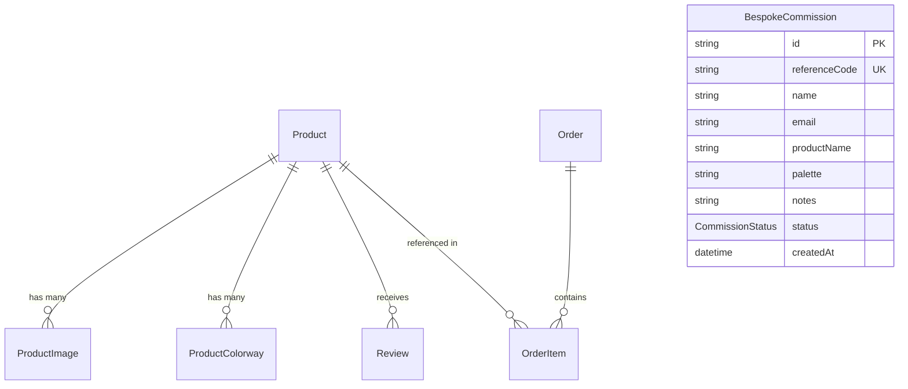

# E&A ATELIER — Artisanal Studio
### Handcrafted Luxury Crochet Heirlooms & Tactile Artifacts

[](https://nextjs.org/)
[](https://react.dev/)
[](https://www.typescriptlang.org/)
[](https://tailwindcss.com/)
[](https://www.prisma.io/)
[](https://www.postgresql.org/)

An editorial e-commerce platform designed for **E&A Atelier**, a slow-luxury studio creating hand-looped crochet heirlooms, tactile artifacts, and wearable sculptures designed to age with deliberate grace in Saint-Rémy-de-Provence.

---

## Brand & Craft Philosophy

A crocheted knot cannot be created by mechanical loom: every single loop in our atelier represents a deliberate pause, adjusted to the natural breath of unbleached flax.

- **Radical Slowdown**: Zero automated machines. Over 14,100+ manual loops per heirloom garment governed by solar seasons and circadian rhythms.
- **Earth-Honouring Fibers**: Exclusively unbleached Belgian linen, organic Aegean cotton, and wild coastal raffia with **0% petroleum-derived synthetics**.
- **Botanical Color Chemistry**: Plant and mineral infusions—wild madder root, elderberry, and French walnut shell low-heat kettle baths.
- **Embodied Continuity**: Continuous single-thread construction yielding zero fabric offcut waste.

---

## Key Features

### 1. Multi-Currency Commerce Engine
- **Global Currency Switching**: Instant conversion across **NGN (₦)** (default), **USD ($)**, **EUR (€)**, and **GBP (£)**.
- **Dynamic Free Shipping Progress**: Live calculation threshold (e.g. $300 USD equivalent) informing shoppers of their remaining qualification amount in real time.
- **Persistent Local Cart & Wishlist**: Client-side state managed via React Context and synchronized with browser storage.

### 2. Curated Catalog & Dynamic Discovery (`/shop`)
- Filter by artisanal categories: *Bags*, *Wearables*, *Accessories*, and *Home Objects*.
- Filter by availability status: *In Stock*, *Made on Demand*, *Limited Edition*, and *Capsule Preview*.
- Sort by edition, price, craft hours, and recency.
- Quick interactive stitch inspection and rapid addition to cart.

### 3. Comprehensive Product Detail Pages (`/product/[id]`)
- Multi-angle high-resolution gallery and zoom capability.
- Interactive colorway swatch picker updating hero imagery in real time.
- Detailed craft specifications: body fiber lineage, structural rope composition, dye chemistry, care instructions, and shipping protocols.
- Verified collector reviews with 5-star ratings and artisanal recommendations.

### 4. Interactive Stitch Anatomy Inspector
- Dedicated interactive modal revealing loop morphology, yarn tension profiles, fiber origin, and artisan notes for each piece.

### 5. Wearables Lookbook & Priority Capsule Access (`/wearables`)
- Lookbook prototype proof plates for upcoming apparel releases (scallop vests, halter tops, rib chevron cardigans).
- VIP archival priority access waitlist registration.
- Roadmap to release timeline tracking harvest, retting, live drape calibration, and botanical baths.
- Direct inquiry gateway for bespoke bridal and haute-couture ceremonial commissions.

### 6. The Craft & Provenance Archive (`/craft`)
- **Interactive Tension Wave Simulator**: Live interactive SVG visualizing stitch cadence variations across *Morning Breath (Balanced)*, *Noon Precision (Firm)*, and *Dusk Ease (Supple)*.
- Archival story and foundational four pillars.
- Physical stockists and curated gallery directory across Paris, New York, Kyoto, and London.

### 7. Bespoke Commission Architecture
- Slide-over bespoke inquiry modal connected directly to PostgreSQL via Next.js Server Actions (`submitBespokeCommission`).
- Generates unique commission reference codes with live validation.

---

## Tech Stack

| Layer | Technology | Description |
| :--- | :--- | :--- |
| **Framework** | [Next.js 16](https://nextjs.org/) | App Router, Server Components, Server Actions |
| **Frontend** | [React 19](https://react.dev/) | React Server Components & Client Interactive Islands |
| **Styling** | [Tailwind CSS v4](https://tailwindcss.com/) | Modern CSS tokens with `@tailwindcss/postcss` |
| **Typography** | `Playfair Display` & `Plus Jakarta Sans` | Google Fonts loaded through `next/font/google` |
| **Icons** | [Lucide React](https://lucide.dev/) | Consistent iconography |
| **Database** | [PostgreSQL](https://www.postgresql.org/) | Relational database storage |
| **ORM** | [Prisma v7](https://www.prisma.io/) | Prisma ORM with `@prisma/adapter-pg` driver adapter |
| **Language** | [TypeScript 5](https://www.typescriptlang.org/) | End-to-end type safety |

---

## Database Architecture

The schema is defined in [`prisma/schema.prisma`](prisma/schema.prisma) and includes the following primary models:



- **`Product`**: Details, fiber specifications, craft hours, dimensions, price in USD, badges, and status enums.
- **`ProductImage`**: Ordered gallery images per product.
- **`ProductColorway`**: Color options with corresponding preview imagery and hex codes.
- **`Review`**: Customer feedback and star ratings.
- **`Order` & `OrderItem`**: Multi-currency transactions, FX rate snapshot, and shipping details.
- **`BespokeCommission`**: Custom commission requests and status pipeline.

---

## Directory Structure

```
E-A_Atelier/
├── app/
│   ├── actions/                  # Next.js Server Actions (bespoke, products)
│   ├── components/               # Global layout & UI components
│   │   ├── BespokeModal.tsx      # Custom commission submission modal
│   │   ├── CartDrawer.tsx        # Slide-out cart with free shipping meter
│   │   ├── Footer.tsx            # Atelier footer & brand credentials
│   │   ├── Header.tsx            # Navigation, currency switcher & badges
│   │   ├── ProductCard.tsx       # Reusable product card component
│   │   ├── StitchInspectModal.tsx# Stitch anatomy inspection modal
│   │   └── WishlistDrawer.tsx    # Slide-out saved items drawer
│   ├── context/                  # StoreContext (cart, wishlist, currency, modals)
│   ├── craft/                    # Provenance & craft story page
│   ├── data/                     # Seed dataset & static product fallbacks
│   ├── generated/prisma/         # Generated Prisma client output
│   ├── product/[id]/             # Dynamic product detail pages
│   ├── shop/                     # Full catalog page with filters
│   ├── wearables/                # Wearables capsule lookbook & waitlist
│   ├── globals.css               # Design tokens, fonts, and theme colors
│   ├── layout.tsx                # Root layout & providers
│   └── page.tsx                  # Atelier homepage
├── lib/
│   ├── mapProduct.ts             # Database entity to UI view model adapter
│   └── prisma.ts                 # PrismaClient singleton with PrismaPg adapter
├── prisma/
│   ├── schema.prisma             # Data models and enums
│   └── seed.ts                   # Idempotent database seeder
├── public/                       # Static public assets
├── prisma.config.ts              # Prisma CLI configuration
└── package.json                  # Project dependencies & scripts
```

---

## Getting Started

### Prerequisites

- **Node.js**: v18.18.0 or later (Node 20+ recommended)
- **npm**, **pnpm**, or **yarn**
- **PostgreSQL**: A running PostgreSQL instance (local or hosted on Neon, Supabase, etc.)

### 1. Clone & Install Dependencies

```bash
git clone https://github.com/DevTechMike-Coder/E-A_Atelier.git
cd E-A_Atelier
npm install
```

### 2. Configure Environment Variables

Create a `.env` file in the project root:

```env
DATABASE_URL="postgresql://<user>:<password>@<host>:<port>/<dbname>?sslmode=require"
DIRECT_URL="postgresql://<user>:<password>@<host>:<port>/<dbname>?sslmode=require"
```

- `DATABASE_URL`: Connection pool URL used by the Prisma driver adapter during runtime.
- `DIRECT_URL`: Direct database connection used by Prisma CLI for migrations.

### 3. Setup Database & Generate Prisma Client

```bash
# Push schema to database
npx prisma db push

# Generate Prisma Client
npm run postinstall
```

### 4. Seed the Database

Populate the database with the initial handcrafted catalog:

```bash
npx tsx prisma/seed.ts
```

### 5. Run Development Server

```bash
npm run dev
```

Open [http://localhost:3000](http://localhost:3000) in your browser to view the atelier.

---

## Available Scripts

| Command | Description |
| :--- | :--- |
| `npm run dev` | Starts the Next.js development server at `localhost:3000` |
| `npm run build` | Builds the production bundle |
| `npm run start` | Runs the production build server |
| `npm run lint` | Runs ESLint checks across the codebase |
| `npm run postinstall` | Automatically regenerates the Prisma Client |

---

## Design Palette

The visual aesthetics reflect quiet luxury, textural depth, and archival craftsmanship:

- **Alabaster Linen**: `#fdf8f5` (Canvas background)
- **Obsidian Charcoal**: `#1c1b1a` (Primary typography & dark hero banners)
- **Tuscan Terracotta / Brass**: `#8a6f5a` / `#705743` (Accents, badges & borders)
- **Parchment Stone**: `#efe7da` (Card surfaces & secondary containers)

---

## License

This project is private and proprietary to **E&A Atelier**. All rights reserved.
